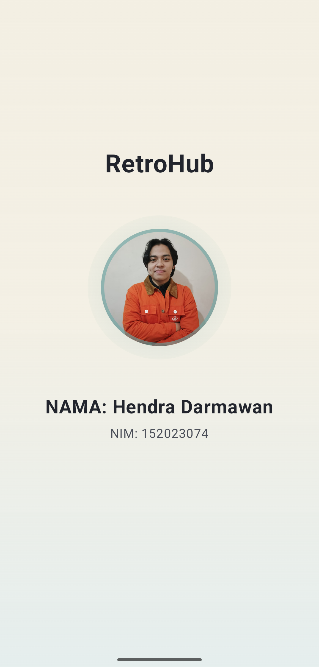
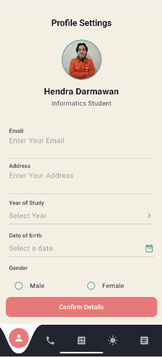
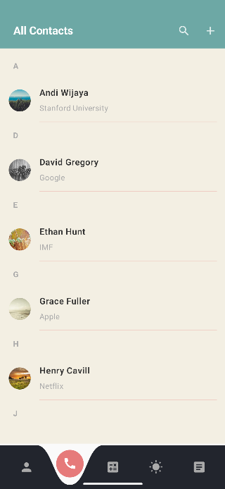
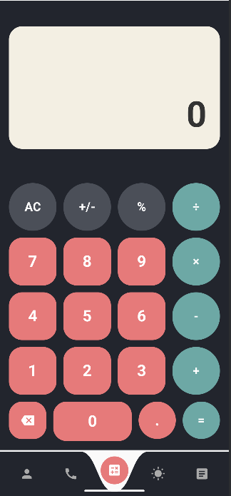
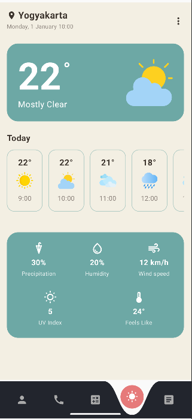
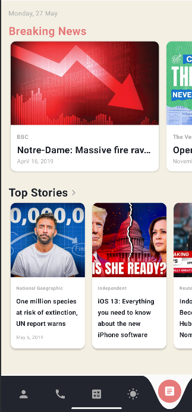

# UTS Pemrograman Mobile

*Mata Kuliah:* Pemrograman Mobile  
*Program Studi:* Informatika  
*Kelas:* BB  
*Dosen Pengampu:* Galih Ashari R., S.Si., MT  
*Tanggal Ujian:* 13 November 2025  

---

## Identitas Mahasiswa

| Nama                      | NIM           | Kelas  |
| ------------------------- | ------------- | ------ |
| *Hendra Darmawan* | *152023074* | *BB* |

## Link Repository GitHub

🔗 https://github.com/hendramhs/MobileUI

## Deskripsi Aplikasi

Aplikasi mobile berbasis Flutter yang menampilkan 5 halaman utama dengan berbagai widget dan layout:

1. *Splash Screen* - Tampilan awal dengan profil dan informasi mahasiswa
2. *Biodata* - Form input data pribadi dengan berbagai widget input
3. *Daftar Kontak* - Menampilkan daftar kontak dengan fitur pencarian
4. *Kalkulator* - Kalkulator sederhana dengan operasi dasar
5. *Cuaca* - Informasi cuaca dengan berbagai detail (Air Quality, UV Index, Sunrise, Wind, Rainfall)
6. *Berita* - Daftar berita dengan kategori dan fitur filter

## Fitur Utama

### 1. Splash Screen

- Durasi 5 detik dengan animasi
- Menampilkan foto profil (riza.png)
- Judul Aplikasi "RetroHub"
- Informasi NIM dan nama mahasiswa
- Animasi Sederhana

### 2. Halaman Biodata

- Form input :
  - Email
  - Alamat
  - Jenis Kelamin (Radio Button)
  - Tanggal Lahir (Date Picker)
  - Tahun Angkatan (Dropdown)
- Foto profil dengan border 
- Design retro 

### 3. Daftar Kontak

- List 15 kontak dengan informasi Nama
- Search bar untuk mencari kontak
- Circle avatar dengan foto
- Pengurutan nama kontak berdasarkan abjad

### 4. Kalkulator

- Operasi matematika: +, -, ×, ÷
- Display dengan background style retro
- Button dengan warna berbeda (pink untuk angka, biru untuk operator)
- Desain Retro

### 5. Cuaca

- Tampilan cuaca hari ini 
- Prediksi Cuaca per jam
- Kualitas Udara 
- UV Index 
- temperatur 
- Kecepatan angin
- Kelembapan

### 6. Berita

- item berita dengan kategori berbeda(breaking news, top stories)
- Card design dengan horizontal sweep

## Screenshots

| Splash Screen                                          | Biodata                                          | Kontak                                                 |
| ------------------------------------------------------ | ------------------------------------------------ | ------------------------------------------------------ |
|  |  |  |

| Kalkulator                                          | Cuaca                                       |
| --------------------------------------------------- | ---------------------------------------------- |
|  |  | 

| Berita                                     |
| ----------------------------------------------- |
|  | 

## Widget yang Digunakan

### Widget Dasar

- Scaffold, AppBar, BottomNavigationBar
- Container, Card, ListTile
- Row, Column, Stack, Positioned
- ListView, PageView, SingleChildScrollView
- Image.asset, CircleAvatar, Icon

### Widget Input

- TextField (untuk input teks)
- Radio (untuk jenis kelamin)
- DropdownButton (untuk thn angkatan)
- DatePicker (untuk tanggal lahir)

### Widget Custom

- CustomPainter (untuk Sunrise arc visualization)
- Transform.rotate (untuk decorative elements)
- AnimatedBuilder (untuk splash screen animations)

### Styling

- BoxDecoration dengan border, borderRadius, boxShadow
- TextStyle dengan berbagai font weight dan size
- Gradient untuk background
- Hard shadows (Neobrutalism style)
- Color palette: Purple (#5936B4), Mint (#A8E6CF), Yellow (#F9E2AF), dll.

## Teknologi yang Digunakan

- Kotlin
- Jetpack Compose
- Navigation Compose
- Material 3 Design
- LazyColumn & LazyRow untuk list berita dan ramalan cuaca
- State Management menggunakan remember dan mutableStateOf

## Catatan 

- Aplikasi menggunakan design  *Retro* 
- Semua teks pada Aplikasi enggunakan ahasa Inggris

---

*Dibuat oleh Hendra Darmawan*
